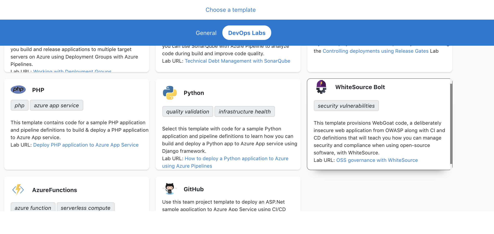
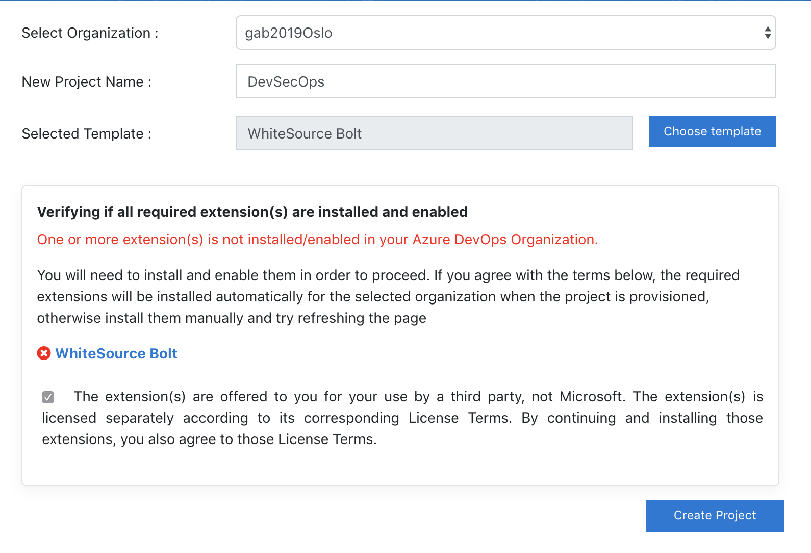
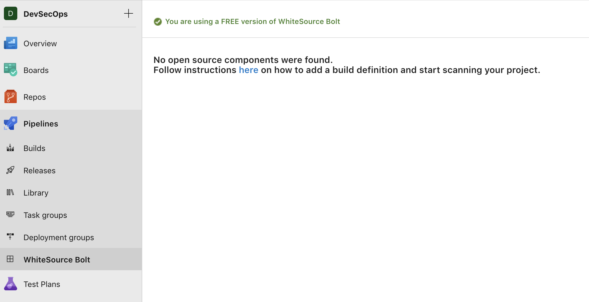
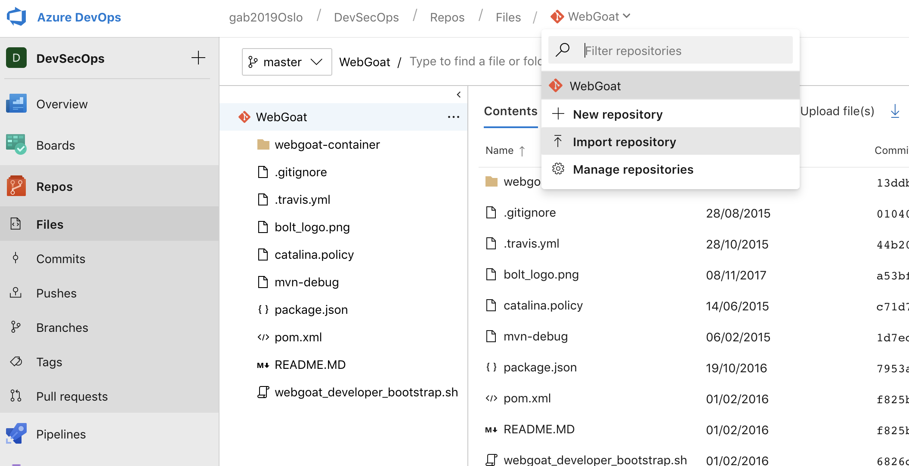

Global Azure Bootcamp 2019 Oslo. DevSecOps workshop

**Contents**
<!-- TOC -->

- [DevSecOps in Azure DevOps workshop](#devsecops-in-azure-devops-workshop)
  - [Requirements](#requirements)
    - [MS Azure subscription](#ms-azure-subscription)
    - [MS Azure DevOps](#ms-azure-devops)
  - [DevSecOps workshop steps](#devsecops-workshop-steps)
    - [Setup Azure DevOps Project](#setup-azure-devops-project)

<!-- /TOC -->
# DevSecOps in Azure DevOps workshop
## Requirements
1. Microsoft Azure subscription 
2. Microsoft Azure DevOps organization
### MS Azure subscription 
If you don't have MS Azure subscription, create Azure free account here: <https://azure.microsoft.com/en-us/free/> by choosing "Start free"
### MS Azure DevOps
To create a brand new Azure DevOps Organization navigate to <https://dev.azure.com> and choose "Start free"
## DevSecOps workshop steps
### Setup Azure DevOps Project
>Workshop is using a preconfigured project from Azure DevOps Labs to enrich quick start.

Start by creating a new Project using a preselected Lab. For that, on your browser navigate to the following URL:  <https://azuredevopsdemogenerator.azurewebsites.net/>

1. Navigate to the Azure DevOps Demo Generator and *Sign In* with the credentials you've used to create the Azure DevOps Organization, and then press the **Accept** button to proceed.

2. Select your Organization from the dropdown, fill in the *Project Name* with a name of your choice. Choose Template -> DevOps Labs -> Whitesource Bolts

3. Check the checkbox to allow WhiteSource Bolt to be installed and press Create Project

4. After project is created *Navigate to project*.

5. Install additional extension from the Marketplace: *ARM Outputs*. The extension reads the output values of an ARM deployment and sets them as them as Azure Pipeline variables.
   1. Navigate to the URL: <https://marketplace.visualstudio.com/items?itemName=keesschollaart.arm-outputs> and select *Get it free button*
   2. Select recently created Azure DevOps Organization on the dropdown list and press Install
   3. After a few seconds you should see a success message. Now, select the Proceed to organization.
6. Activate WhiteSource Bolt extension
   1. Navigate to *WhiteSource Bolt* under *Pipelines -> WhiteSource Bolt*
   2. Fill in your details to create a free account
   
   3. After a few seconds, we're good to go!
   
7. Import additional Git repositories needed for the workshop
   1. Navigate to *Repos* and on the upper repositories drop down, select *Import repository*
   

